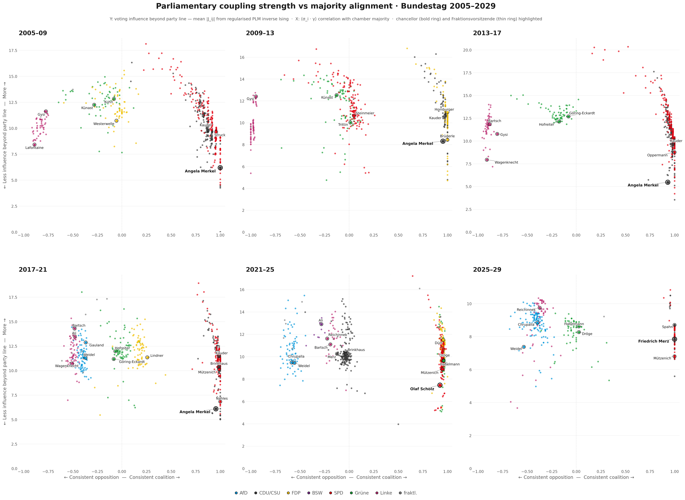
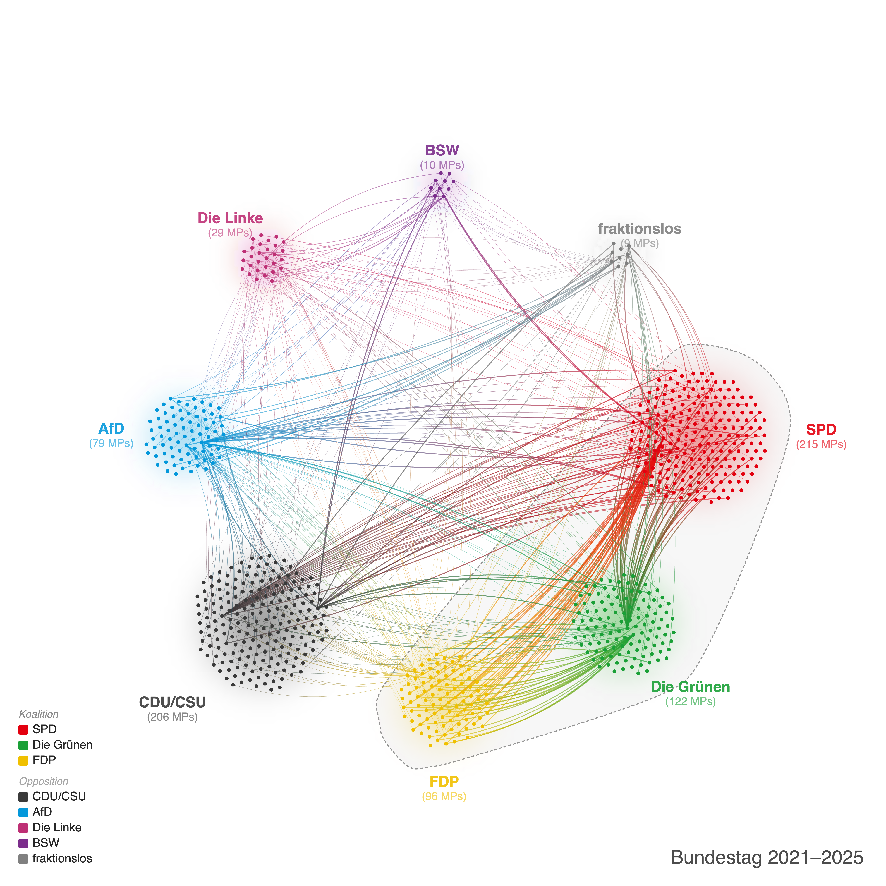
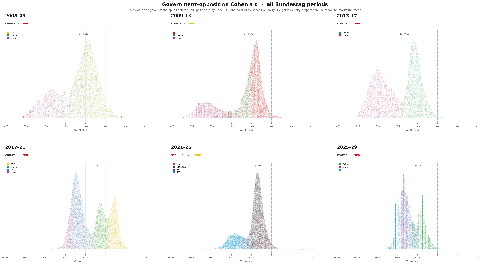

# Bundestag Voting Analysis

Analysis of German parliamentary voting behaviour across six Bundestag periods (2005–2029), with a parallel analysis of UK House of Commons divisions (2017–). Pairwise voting similarity between MPs is measured with Cohen's κ, then visualised through network graphs, dimensionality reduction, and statistical physics models.

**Posts:**
- [Is German Politics Becoming More Polarised?](https://philippkreiter.com/polarisation-in-german-politics/) — `analysis/cohesion/`
- [The Great MP Theory - Do Bundestag Leaders Actually Influence Votes?](https://philippkreiter.com/bundestag_leaders_influencing_votes/) — `analysis/ising/`

---

<picture>
  <source media="(prefers-color-scheme: dark)" srcset="docs/img/plm_influence_dark.png">
  
</picture>

*Each dot is one MP. X: alignment with chamber majority. Y: PLM coupling strength (influence beyond party line). Chancellor highlighted with bold ring — consistently in the bottom 2–5% of coupling across all periods.*

<picture>
  <source media="(prefers-color-scheme: dark)" srcset="docs/img/network_dark.png">
  
</picture>

*Voting similarity network for the 2021–25 Bundestag. Edges connect MP pairs with κ > 0.15; edge color blends the two party colors.*

<picture>
  <source media="(prefers-color-scheme: dark)" srcset="docs/img/kappa_dots_govoppo_dark.png">
  
</picture>

*Each dot is one government–opposition MP pair, positioned by Cohen's κ and colored by opposition party.*

---

## Repository structure

```
├── pipeline/              # Bundestag data acquisition and κ computation (Python)
├── analysis/
│   ├── cohesion/          # Post 1 — κ distributions, network graphs, MDS, UMAP
│   └── ising/             # Post 2 — PLM inverse Ising (Bundestag + UK Commons)
├── renderer/              # Network graph renderer (Node.js / D3 / Puppeteer)
├── config/                # Party colours and coalition definitions
└── output/                # Generated data and figures (not tracked)
```

## Data flow

### Bundestag
```
pipeline/scrape.py                 →  output/{period}/polls.jsonl
                                       output/{period}/votes.jsonl
pipeline/build_raw.py              →  output/{period}/raw.json
pipeline/ingest.py                 →  output/{period}/nodes.csv, edges.csv
pipeline/compute_allpairs_kappa.py →  output/{period}/edges_allpairs.csv

analysis/cohesion/*.py             →  output/img/{dark,light}/*.png
analysis/ising/mp_ising_plm.py     →  output/mp_ising_field_cache.csv
analysis/ising/*.py                →  output/img/{dark,light}/ising/*.png
```

### UK House of Commons
```
analysis/ising/uk_commons_scrape.py    →  output/uk_commons_{period}/raw.json
                                           output/uk_commons_{period}/nodes.csv
analysis/ising/uk_commons_plm_cache.py →  output/uk_ising_field_cache.csv
analysis/ising/uk_commons_ridgeline.py →  output/img/{dark,light}/ising/uk_commons_ridgeline.png
analysis/ising/uk_commons_plm_influence.py → output/img/{dark,light}/ising/uk_commons_plm_influence.png
```

Bundestag periods: **2005–09 · 2009–13 · 2013–17 · 2017–21 · 2021–25 · 2025–29**
UK Commons periods: **2017–19 · 2019–24 · 2024–**

## Usage

```bash
pip install -r requirements.txt   # Python 3.10+
cd renderer && npm install         # Node.js 18+ for network graphs

# --- Bundestag pipeline ---

# 1. Scrape raw data
python pipeline/scrape.py --outdir output/bundestag_2021_2025

# 2. Build voting similarity graph
python main.py --votes output/bundestag_2021_2025/votes.jsonl \
               --polls output/bundestag_2021_2025/polls.jsonl \
               --out-dir output/bundestag_2021_2025

# 3. Compute all-pairs κ matrix
python pipeline/compute_allpairs_kappa.py bundestag_2021_2025

# 4. Fit PLM inverse Ising and cache per-MP coupling
python analysis/ising/mp_ising_plm.py

# 5. Run analysis scripts (all accept optional 'light' for light-mode output)
python analysis/cohesion/mp_kappa_dots_govoppo.py
python analysis/cohesion/mp_kappa_ridgeline.py light
python analysis/ising/mp_ising_plm_influence.py
python analysis/ising/mp_ising_chancellor_ridgeline.py light

# --- UK Commons pipeline ---

# 1. Scrape divisions from UK Parliament API
python analysis/ising/uk_commons_scrape.py

# 2. Fit PLM and cache coupling
python analysis/ising/uk_commons_plm_cache.py

# 3. Generate plots
python analysis/ising/uk_commons_ridgeline.py light
python analysis/ising/uk_commons_plm_influence.py light
```

## Methodology

**Cohen's κ** measures pairwise voting similarity controlling for chance agreement. κ = 1: identical records; κ = 0: independent; κ < 0: systematic disagreement.

**MDS** projects the κ-distance matrix to 1D, oriented so coalition parties sit on the positive side — giving a consistent opposition ↔ coalition axis across all periods.

**PLM inverse Ising** fits one L2-regularised logistic regression per MP (spin), predicting each MP's vote from all others' votes. Couplings J_ij are symmetrised: J = (J_raw + J_raw^T) / 2. Per-MP coupling strength = mean_j |J_ij| × 1000. Majority alignment c_i = ⟨σ_i · γ_t⟩ where γ_t = sign of chamber sum per poll. Near-unanimous votes (outside 5–95% yes-fraction) and MPs with <10% participation are excluded. Regularisation: C = 0.05.

Key finding: chancellors and prime ministers rank in the bottom 2–5% of coupling strength in every period — consistent with executive power exercised upstream of the voting chamber.

## License

MIT
